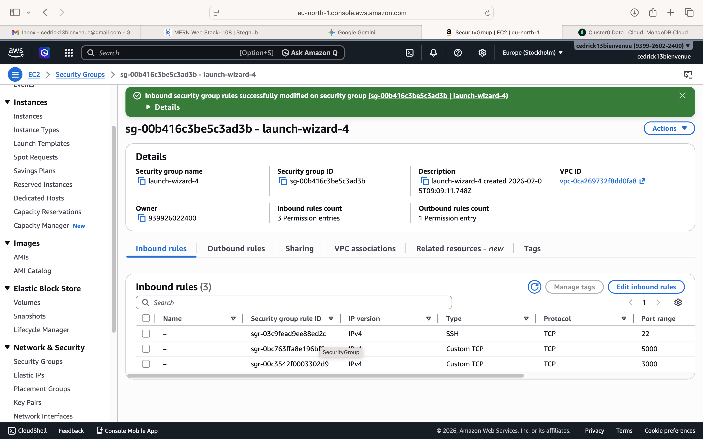
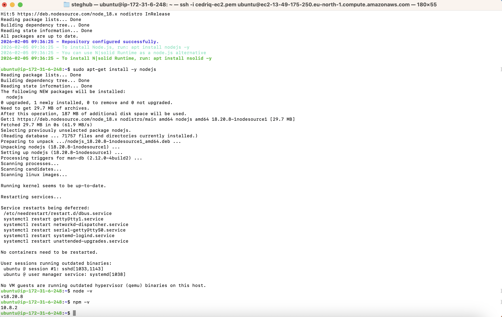
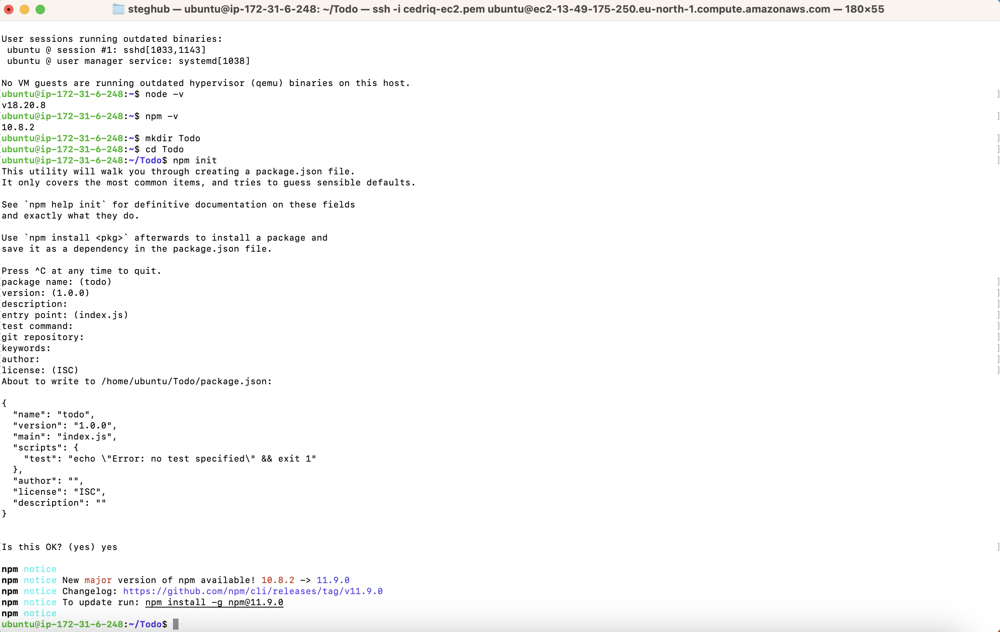
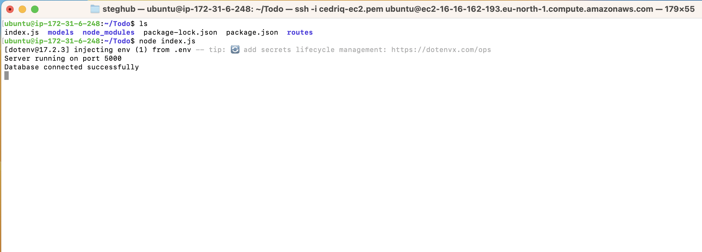
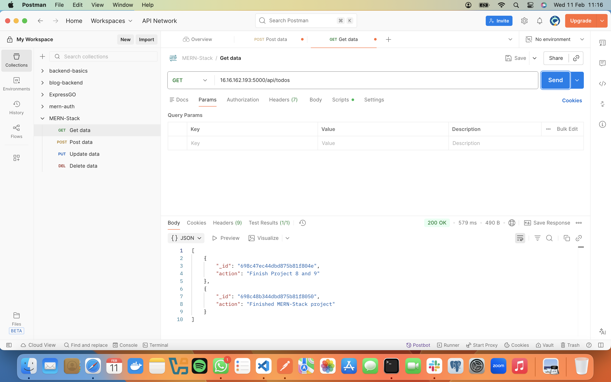

# MERN Stack Implementation on AWS

## Project Overview

This project involves the deployment of a **MERN Stack** (MongoDB, Express, React, Node.js) web application on an AWS EC2 instance. The architecture consists of a React frontend communicating with a Node.js/Express backend, which performs CRUD operations on a MongoDB database.

---

## Phase 0: Preparing Prerequisites

To begin, provision a virtual server that will host all four components of the MERN stack.

* **Instance Provisioning:** Launch a new EC2 Instance of the `t2.micro` family running **Ubuntu Server 24.04 LTS**.
* **Tagging:** Add a Tag with Key `Name` and Value `MERN-Stack-Server`.
* **Networking:** Configure the Security Group with the following **Inbound Rules**:

| Protocol | Port Range | Source | Purpose |
| --- | --- | --- | --- |
| SSH | 22 | `0.0.0.0/0` | Remote Terminal Access |
| Custom TCP | 5000 | `0.0.0.0/0` | Node.js/Express Backend API |
| Custom TCP | 3000 | `0.0.0.0/0` | React Frontend Dev Server |

> **Expected Output:** The "Inbound rules" tab should confirm three permission entries, specifically showing Ports 3000 and 5000 as open to allow full-stack connectivity.
>


---

## Phase 1: Backend Configuration (Node.js & Express)

### 1.1 Node.js Installation

```bash
sudo apt update && sudo apt upgrade -y
curl -fsSL https://deb.nodesource.com/setup_18.x | sudo -E bash -
sudo apt-get install -y nodejs

```

> **Expected Output:** Running `node -v` and `npm -v` should display the installed versions.
>
### 1.2 Application Code Setup

```bash
mkdir Todo && cd Todo && npm init -y
npm install express mongoose dotenv
touch index.js .env

```

> **Expected Output:** A `package.json` file should be generated in the directory.
>

---

## Phase 2: Defining the API Routes

### 2.1 Route Folder Setup

```bash
mkdir routes && cd routes && touch api.js

```

### 2.2 Implementing the API Endpoints (`routes/api.js`)

```javascript
const express = require('express');
const router = express.Router();
const Todo = require('../models/todo');

router.get('/todos', (req, res, next) => {
  Todo.find({}, 'action').then(data => res.json(data)).catch(next);
});

router.post('/todos', (req, res, next) => {
  if (req.body.action) {
    Todo.create(req.body).then(data => res.json(data)).catch(next);
  } else {
    res.json({ error: "The input field is empty" });
  }
});

router.delete('/todos/:id', (req, res, next) => {
  Todo.findOneAndDelete({"_id": req.params.id}).then(data => res.json(data)).catch(next);
});

module.exports = router;

```

---

## Phase 3: The Data Model (Mongoose)

### 3.1 Model Setup

```bash
cd ..
mkdir models && cd models && touch todo.js

```

### 3.2 Defining the Schema (`models/todo.js`)

```javascript
const mongoose = require('mongoose');
const Schema = mongoose.Schema;

const TodoSchema = new Schema({
  action: {
    type: String,
    required: [true, 'The todo text field is required']
  }
})

const Todo = mongoose.model('todo', TodoSchema);
module.exports = Todo;

```


---

## Phase 5: Database Connection and Security

### 5.1 Create the .env File

```bash
cd ..
touch .env && vim .env

```

**Paste your Atlas string:**

```text
DB = 'mongodb+srv://<username>:<password>@cluster0.mongodb.net/myTodoDB'

```

### 5.2 Finalizing the Entry Point (`index.js`)

```javascript
const express = require('express');
const mongoose = require('mongoose');
const routes = require('./routes/api');
require('dotenv').config();

const app = express();
const port = process.env.PORT || 5000;

mongoose.connect(process.env.DB)
  .then(() => console.log(`Database connected successfully`))
  .catch(err => console.log(err));

app.use(express.json());
app.use('/api', routes);

app.use((err, req, res, next) => {
  console.log(err);
  next();
});

app.listen(port, () => {
  console.log(`Server running on port ${port}`);
});

```

> **Expected Output:** Running `node index.js` should display established database connection.
>
---

## Phase 6: Testing Backend API (Postman)

Validate the backend functionality before building the UI:

* **POST Request**: `http://<IP>:5000/api/todos` (Header: `Content-Type: application/json`, Body: `{"action": "Finish Project 8 and 9"}`).
* **GET Request**: Retrieve tasks to verify persistence.
* **DELETE Request**: Verify deletion using the unique task `_id`.

> **Expected Output:** A `200 OK` status and JSON data returned from the server.
>

---

## Phase 7: Frontend Development (React)

### 7.1 React Scaffolding & Proxy

```bash
npx create-react-app client
cd client && npm install axios

```

**Configure Proxy** in `client/package.json`:

```json
"proxy": "http://localhost:5000"

```

### 7.2 Main Components (`client/src/components/`)

**1. Todo.js (State Manager):**

```javascript
import React, { Component } from 'react';
import axios from 'axios';
import Input from './Input';
import ListTodo from './ListTodo';

class Todo extends Component {
  state = { todos: [] }
  componentDidMount() { this.getTodos(); }
  getTodos = () => {
    axios.get('/api/todos').then(res => {
      if (res.data) { this.setState({ todos: res.data }) }
    }).catch(err => console.log(err))
  }
  deleteTodo = (id) => {
    axios.delete(`/api/todos/${id}`).then(res => {
      if (res.data) { this.getTodos() }
    }).catch(err => console.log(err))
  }
  render() {
    let { todos } = this.state;
    return (
      <div>
        <h1>My Todo(s)</h1>
        <Input getTodos={this.getTodos} />
        <ListTodo todos={todos} deleteTodo={this.deleteTodo} />
      </div>
    )
  }
}
export default Todo;

```

**2. App.js (`client/src/App.js`):**

```javascript
import React from 'react';
import Todo from './components/Todo';
import './App.css';

const App = () => {
  return (
    <div className="App">
      <Todo />
    </div>
  );
}
export default App;

```

---